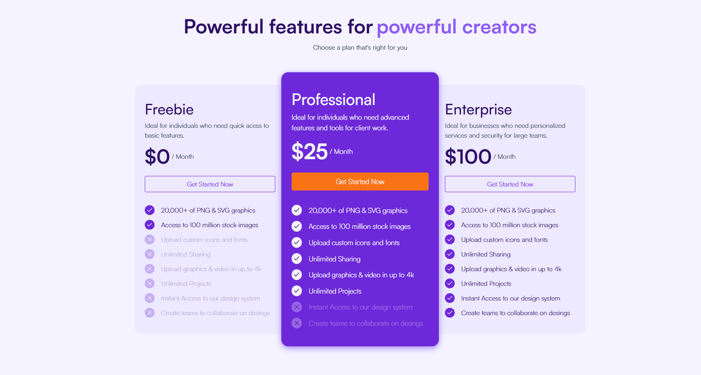
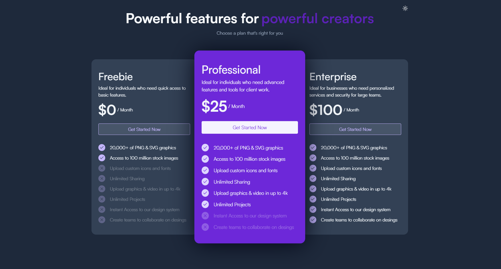

## Introduction

This project is a modern subscription pricing UI that presents three different plans: Freebie, Professional, and Enterprise. The design is optimized for a seamless user experience, allowing users to quickly compare features and select the best plan for their needs.




It's built on:

- Next.js - React framework for production
- Tailwind CSS - Utility-first CSS framework
- Storybook - UI component explorer
- Jest - JavaScript testing framework
- Mock Service Worker (MSW) - API mocking library
- TypeScript - Static type checking

## Getting Started

### Prerequisites

To get started with Payara, ensure you have the following prerequisites installed and set up:

- Node.js 20.18.0 or later

### First, run the development server:

```bash
npm run dev
# or
yarn dev
# or
pnpm dev
# or
bun dev
```

Open [http://localhost:3000](http://localhost:3000) with your browser to see the result.

### To run the storybook:

```bash
npm run storybook
```

Open [http://localhost:6006](http://localhost:6006) with your browser to see the result.

### To run the react test:

```bash
npm test
```

## Deploy on Vercel

The easiest way to deploy your Next.js app is to use the [Vercel Platform](https://vercel.com/new?utm_medium=default-template&filter=next.js&utm_source=create-next-app&utm_campaign=create-next-app-readme) from the creators of Next.js.

Check out our [Next.js deployment documentation](https://nextjs.org/docs/app/building-your-application/deploying) for more details.
